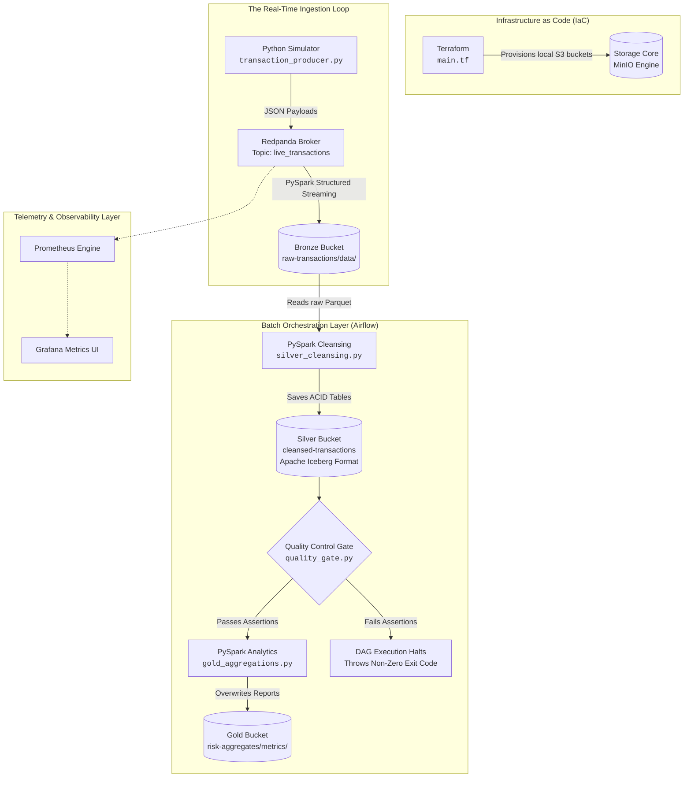

# Fintech Transaction Monitoring & Risk Lakehouse


## Project Overview
This project simulates a financial gateway scenario where a continuous stream of payment transaction events is ingested, checked for data quality anomalies, and processed in near real time. The event producer (`transaction_producer.py`) emits events at a configurable rate (`EVENTS_PER_SECOND`), so the same medallion architecture that handles a local demo stream is designed to scale toward production transaction volumes via configuration, not a rewrite. The primary objective was to design and build a functional, real-time data streaming platform that captures raw JSON transaction events, enforces automated validation pipelines, and surfaces aggregated data models for risk analysis.

To gain a deep understanding of infrastructure configuration, local cloud emulation, file access abstractions, and distributed processing engines, this platform was built using a **100% local, zero-cost enterprise architecture** using Docker to connect storage, message brokers, and workflow orchestrators.

## The Motivation & Use Case
In financial payment networks, fraud detection and risk modeling rely heavily on clean, historically consistent datasets. Processing streaming inputs often presents two classic data engineering hurdles: maintaining downstream data consistency across pipeline reruns and ensuring corrupt data payloads (such as negative transaction values or malformed currencies) are filtered before updating analytical models.

To tackle these production challenges, this pipeline was designed to:
1. **Handle high-velocity real-time event streaming** with zero message drop or bottleneck risks.
2. **Maintain complete idempotency** across batch runs using modern open table specifications.
3. **Enforce automated data quality gates** to prevent problematic records from reaching downstream analytical engines.
4. **Deliver analytical-ready aggregations** optimized for interactive business intelligence and fraud modeling.

## System Architecture



## Tech Stack
* **Infrastructure as Code:** Terraform (declaring S3 mock buckets locally via custom endpoint configurations pointing straight to MinIO)
* **Storage Layer:** MinIO (Local S3-compatible Object Storage providing the unified storage backend for both raw data and the Apache Iceberg warehouse)
* **Message Broker:** Redpanda (High-throughput, developer-centric Kafka API compatible streaming engine running in a lightweight single-container setup)
* **Compute Engine:** Apache Spark / PySpark 3.5.0 (Custom container builds bundled with native Hadoop S3A filesystem connectors for reading from and writing to local object storage buckets)
* **Table Format:** Apache Iceberg (providing atomic ACID transactions, snapshot version isolation, and strict schema protection parameters for the Silver cleansed layer)
* **Workflow Orchestration:** Apache Airflow 2.7.1 (Multi-container architecture separating webserver and scheduler processes to coordinate batch pipelines and data quality loops)
* **Infrastructure:** Docker & Docker-Compose (orchestrating the entire distributed cluster stack across an isolated local bridge network)
* **Telemetry & Observability:** Prometheus & Grafana (Configured with file persistence volume mappings to capture continuous runtime metrics, tracking streaming throughput and consumer lag)
* **Languages & Libraries:** Python, `pydantic`, `faker`, `confluent-kafka`, `pytest`, `flake8`
* **CI/CD:** GitHub Actions (`.github/workflows/ci.yml`) — runs on every push and pull request to `main`, installing Python 3.11 and Java 17 (required for PySpark), then gating the build on two checks: a `flake8` lint pass and a `pytest` run of PySpark unit tests


# How the Data Flows

**The Event Generator**: `transaction_producer.py` uses Faker and Pydantic to structure transaction instances, validate input types, and continuously emit JSON events into the Redpanda broker network.

**The Raw Storage Ingestion**: `bronze_ingestion.py` runs a continuous structured streaming thread. It converts incoming broker binary payloads into tabular formats and flushes them into `s3a://raw-transactions/data/`.

**The Cleansing Cycle**: Scheduled hourly by Airflow, `silver_cleansing.py` reads the raw Parquet blocks, applies an explicit StructType schema, drops duplicate keys using `.dropDuplicates(["transaction_id"])`, and writes the clean rows to the Iceberg format cataloged as `local.db.transactions`.

**The Gatekeeper Validation**: `quality_gate.py` processes the updated Iceberg dataset. It scans columns for non-positive amounts, blank transaction IDs, or unsupported financial currencies, invoking a hard `sys.exit(1)` script crash if data anomalies violate compliance rules.

**The Reporting Synthesis**: Once cleared by the quality gate, `gold_aggregations.py` applies Spark SQL querying architectures to compute metrics (such as cumulative volumes spent and unique merchant footprints per user) and records them safely into production-ready Parquet targets.

# Testing & CI/CD

Every push and pull request to `main` triggers a GitHub Actions workflow (`.github/workflows/ci.yml`) that:

1. Checks out the code and sets up Python 3.11 and Java 17 (PySpark requires a JVM).
2. Runs `flake8` as a hard lint gate — the build fails on syntax errors or undefined names.
3. Runs `pytest tests/`, which spins up a local, single-node Spark session and unit-tests the exact deduplication and filtering logic used in production: `tests/test_silver_logic.py` feeds `silver_cleansing.py`'s transformation chain a small mock DataFrame containing a duplicate transaction ID, a negative amount, and a zero amount, then asserts that only the 2 valid rows survive.

This means the Silver-layer cleansing logic is verified automatically before it can be merged — not just manually spot-checked.

# How to Run It Locally

## Prerequisites

- Docker Desktop configured with a minimum of 6GB allocated memory.
- Terraform CLI.
- Python 3.11+ environment with an isolated virtual environment shell ```(venv)```.


**1. Clone the project repository and set up dependencies.**

```bash
git clone <your-repository-url>
cd fintech-risk-lakehouse

python -m venv venv
source venv/bin/activate
pip install -r requirements.txt
```

**2. Provision the Mock Storage Infrastructure:** Ensure the Docker engine is active, then initialize and apply the local cloud infrastructure via Terraform:
```bash
terraform init
terraform apply -auto-approve
```

**3. Deploy the Automated Container Core:** Execute the deployment blueprint to compile the custom PySpark environment layers and initialize the orchestration networks:
```bash
docker-compose up -d --build
```
**Verify services via host ports:**

- **Airflow Web UI**: http://localhost:8081 (Credentials: `admin` / `admin`)
- **Grafana Dashboards**: http://localhost:3000 (Credentials: `admin` / `admin`)
- **MinIO Object Console**: http://localhost:9001 (Credentials: `admin` / `password123`)

**Verify the System Pipelines:**

- Open Grafana to monitor real-time throughput metrics collected from the active Redpanda streaming services.
- Open the Airflow console, unpause the `fintech_risk_lakehouse_etl` DAG, and trigger the execution process. The workflow will extract raw transaction entries, push them into the Iceberg table catalogs, enforce quality checks, and output the risk aggregations.
